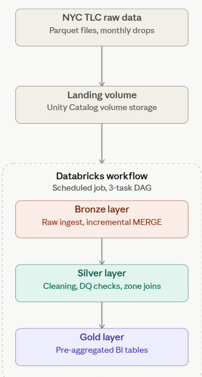

# NYC Taxi Trip Analytics — Databricks Data Pipeline

An end-to-end data engineering pipeline built on **Databricks Free Edition** that ingests, cleans, and aggregates NYC TLC Yellow Taxi trip data using a medallion architecture (Bronze → Silver → Gold), fully orchestrated and scheduled via Databricks Workflows.

## What this project does

- Ingests raw monthly NYC taxi trip data (Parquet) into a Bronze Delta table
- Cleans and enriches the data in a Silver layer (removes invalid records, joins taxi zone names, adds derived metrics like trip duration and tip %)
- Aggregates the data into BI-ready Gold tables (hourly demand, daily summary, borough flow, top zones)
- Runs all three stages automatically as a scheduled job, with incremental loading so new monthly files can be added without duplicating existing data

## Architecture

Each layer is a Delta table in Unity Catalog:
- **Bronze** — raw data, incrementally loaded with `MERGE INTO`
- **Silver** — cleaned data with data quality checks and zone-name joins
- **Gold** — pre-aggregated summary tables, ready for reporting

## Key design decisions

- **Incremental loading (`MERGE INTO`)** — new monthly files are added without reprocessing or duplicating historical data
- **Data quality checks** — row-count and null-rate assertions run before any Silver write, so bad data fails the job instead of silently passing through
- **Scheduled orchestration** — a single Databricks Job chains all three notebooks with explicit task dependencies, so the pipeline runs unattended
- **Dimensional modeling** — the taxi zone lookup is kept as a separate dimension table and joined in for both pickup and dropoff locations

## Results

- Bronze rows ingested: **13,069,067**
- Silver rows after cleaning: **11,459,622**
- Rows filtered out during cleaning (invalid fares, zero-distance trips, bad timestamps): **12.31%**
- Zone-join null rate: **0.0%**

## Tech Stack

- **Databricks Free Edition** — serverless compute, notebooks, SQL Warehouse
- **PySpark** — data transformation and cleaning
- **Delta Lake** — ACID transactions, MERGE, OPTIMIZE/ZORDER
- **Unity Catalog** — catalog/schema governance, Volumes for file landing
- **Databricks Workflows** — job orchestration, scheduling, task dependencies
- **Power BI** — dashboarding via Databricks SQL Warehouse connector

## Dataset

NYC TLC Trip Record Data (official source):
https://www.nyc.gov/site/tlc/about/tlc-trip-record-data.page

- Yellow Taxi trip records, Jan–Mar 2024,
- plus the official Taxi Zone Lookup table.

## Repository Structure

notebooks/
01_bronze_ingest.py     — raw ingestion, incremental MERGE
02_silver_clean.py      — cleaning, derived columns, zone joins, DQ checks
03_gold_aggregate.py    — aggregation into BI-ready Gold tables
docs/
- architecture diagram
- Before-Run
- job_dag
- After-Run
- job_run_history
- tables_list
- sample_gold_output_1
- sample_gold_output_2

## How to reproduce

1. Sign up for [Databricks Free Edition](https://www.databricks.com/learn/free-edition)
2. Create a catalog `nyc_taxi_project` with a `raw` schema and a Volume for landing files
3. Download NYC TLC Yellow Taxi Parquet files + the zone lookup CSV, upload to the Volume
4. Import the notebooks from `/notebooks` into your workspace
5. Create a Databricks Job chaining the three notebooks (Bronze → Silver → Gold) with task dependencies, and add a schedule
6. Run the job — Gold tables will be ready to query via the SQL Editor or a BI tool